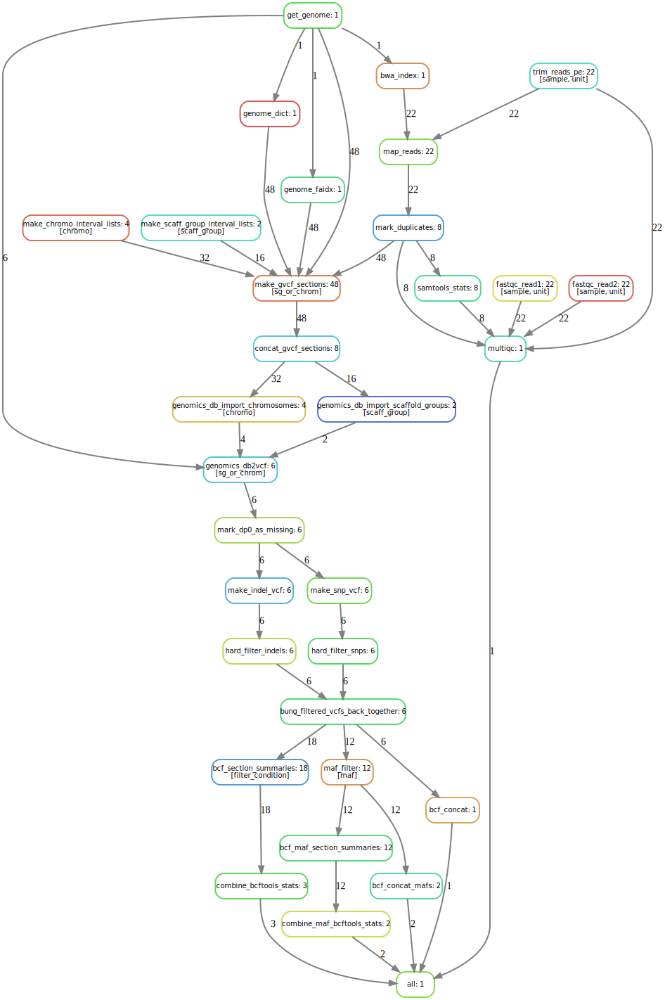

mega-non-model-wgs-snakeflow
================

## Quick install and run

If you would like to put this on your system and test it running on a
single node (more later about using SLURM for deployment across multiple
nodes) you have to clone this repository and then download the
pseudo-genome used for the included test data set (in `.test`).

You must have Snakemake (version &gt; 6.0) in the active environment.

In short, here are the steps to install and run the `.test`.

``` sh
# clone the repo
git clone git@github.com:eriqande/mega-non-model-wgs-snakeflow.git

# download the tarball with the genome in it and then move that
# into resources/
wget --load-cookies /tmp/cookies.txt "https://docs.google.com/uc?export=download&confirm=$(wget --quiet --save-cookies /tmp/cookies.txt --keep-session-cookies --no-check-certificate 'https://docs.google.com/uc?export=download&id=1LMK-DCkH1RKFAWTR2OKEJ_K9VOjJIZ1b' -O- | sed -rn 's/.*confirm=([0-9A-Za-z_]+).*/\1\n/p')&id=1LMK-DCkH1RKFAWTR2OKEJ_K9VOjJIZ1b" -O non-model-wgs-example-data.tar && rm -rf /tmp/cookies.txt

# untar the tarball
tar -xvf non-model-wgs-example-data.tar

# copy the genome from the extracted tarball into mega-non-model-wgs-snakeflow/resources/
cp non-model-wgs-example-data/resources/genome.fasta mega-non-model-wgs-snakeflow/resources/
```

Once that is set up, you can do a dry run like:

``` sh
conda activate snakemake
cd mega-non-model-wgs-snakeflow

# set the number of cores you have access to, to use in the
# following command.  Here I have 12.  You should set yours
# however is appropriate
CORES=12
snakemake --cores $CORES --use-conda --conda-frontend mamba -np
```

If that gives you a reasonable looking output (165 total jobs, lots of
conda environments to be installed, etc.) then take the `-np` off the
end of the command to actually run it:

``` sh
snakemake --cores $CORES --use-conda --conda-frontend mamba
```

Installing all the conda packages could take a while (2–30 minutes,
depending on your system). Once that was done, running all the steps in
the workflow on this small data set required less than 4 minutes on 12
cores of a single node from UC Boulder’s SUMMIT supercomputer.

## Condensed DAG for the workflow

Here is a DAG for the workflow on the test data in `.test`, condensed
into an easier-to-look-at picture by the `condense_dag()` function in
Eric’s [SnakemakeDagR](https://github.com/eriqande/SnakemakeDagR)
package. <!-- -->

## What the user must do and values to be set, etc

-   `samples.tsv` and `units.tsv`
-   Choose an Illuminaclip adapter fasta (in config)

## Assumptions

-   Paired end

## Things fixed or added relative to JK’s snakemake workflow

-   fastqc on both reads
-   don’t bother with single end
-   add adapters so illumina clip can work
-   benchmark each rule
-   use genomicsDBimport
-   allow for merging of lots of small scaffolds into genomicsDB

## Things that will be added in the future

-   Formalize a system for adding samples to the GenomicsDB via the
    updating option.
-   Develop a sane way to iteratively bootstrap some base-quality score
    recalibration.
